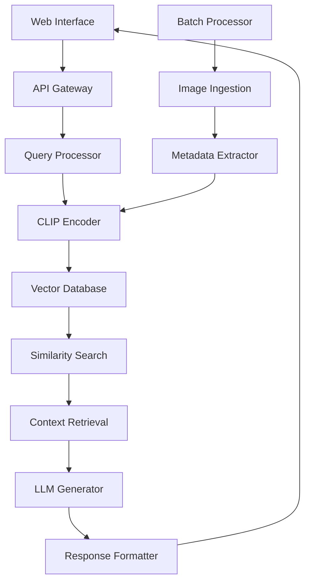

# 🛰️ GeoSpatial-RAG: An AI Framework For Analysis Of Remote Sensing Images

[](https://www.python.org/downloads/)
[](https://opensource.org/licenses/MIT)
[](https://www.docker.com/)
[](https://streamlit.io/)

> **An intelligent assistant tool for researchers and analysts working with remote sensing imagery**

## 🌍 Overview

GeoSpatial-RAG is a cutting-edge AI framework that revolutionizes remote sensing image analysis by combining:
- **Multimodal Large Language Models (MLLMs)** for natural language understanding
- **Vector databases** for efficient similarity search
- **CLIP embeddings** for cross-modal retrieval
- **Interactive web interface** for seamless user experience

Perfect for researchers, environmental scientists, urban planners, and GIS analysts who need intelligent insights from satellite and aerial imagery.

## ✨ Key Features

### 🎯 Core Capabilities
- **Natural Language Querying**: Ask questions about satellite images in plain English
- **Cross-Modal Search**: Find similar images using text descriptions or image examples
- **Intelligent Analysis**: Get detailed insights about terrain, structures, and patterns
- **Multi-Dataset Support**: Works with various remote sensing datasets (RSICD, Sentinel, Landsat)
- **Real-time Processing**: Fast inference with GPU acceleration

### 🛠️ Technical Features
- **Vector Database Integration**: ChromaDB/Pinecone/Weaviate support for scalable storage
- **Cloud-Ready Architecture**: Docker containerization for easy deployment
- **API-First Design**: RESTful APIs for integration with existing workflows
- **Extensible Framework**: Plugin architecture for custom models and datasets
- **Production Monitoring**: Logging, metrics, and health checks

## 🚀 Quick Start

### Prerequisites
- Python 3.8+
- CUDA-compatible GPU (recommended)
- Docker (optional)
- 8GB+ RAM

### Installation

#### Option 1: Docker (Recommended)
```bash
# Clone the repository
git clone https://github.com/your-username/geospatial-rag.git
cd geospatial-rag

# Build and run with Docker Compose
docker-compose up --build
```

#### Option 2: Local Installation
```bash
# Clone and setup
git clone https://github.com/your-username/geospatial-rag.git
cd geospatial-rag

# Create virtual environment
python -m venv venv
source venv/bin/activate  # On Windows: venv\Scripts\activate

# Install dependencies
pip install -r requirements.txt

# Setup environment variables
cp .env.example .env
# Edit .env with your API keys and configurations

# Initialize the database
python scripts/init_database.py

# Run the application
streamlit run app.py
```

### First Steps
1. **Access the Web Interface**: Open http://localhost:8501
2. **Upload Your Data**: Use the data ingestion tool to add your remote sensing images
3. **Start Querying**: Ask questions like "Show me urban areas with dense vegetation"
4. **Explore Results**: View similar images, analysis reports, and downloadable insights

## 📊 Use Cases

### 🌱 Environmental Monitoring
- **Deforestation Detection**: "Find areas where forest cover has decreased"
- **Water Quality Assessment**: "Identify water bodies with potential pollution"
- **Biodiversity Mapping**: "Locate habitats suitable for endangered species"

### 🏙️ Urban Planning
- **Infrastructure Analysis**: "Show me areas with inadequate road connectivity"
- **Land Use Classification**: "Identify residential vs commercial zones"
- **Growth Pattern Analysis**: "Find rapidly expanding urban areas"

### 🆘 Disaster Response
- **Damage Assessment**: "Locate buildings damaged by recent flooding"
- **Emergency Planning**: "Find suitable locations for evacuation centers"
- **Resource Allocation**: "Identify areas most in need of humanitarian aid"

### 🌾 Agriculture
- **Crop Health Monitoring**: "Show me fields with stressed vegetation"
- **Irrigation Planning**: "Identify areas requiring water management"
- **Yield Prediction**: "Analyze crop maturity across different regions"

## 🏗️ Architecture



### Component Details

#### 🔍 Embedding Pipeline
- **Image Encoder**: CLIP ViT-B/32 for visual feature extraction
- **Text Encoder**: CLIP text encoder for query understanding
- **Fusion Strategy**: Weighted similarity scoring (configurable)

#### 🗄️ Vector Database
- **Primary**: ChromaDB for development and small-scale deployments
- **Production**: Pinecone/Weaviate for enterprise-scale applications
- **Features**: Metadata filtering, batch operations, real-time updates

#### 🧠 Generation Pipeline
- **Retrieval**: Top-K similarity search with configurable parameters
- **Context Building**: Intelligent context assembly from retrieved documents
- **Generation**: Fine-tuned language models for remote sensing domain

## 📚 API Reference

### Authentication
```python
headers = {
    'Authorization': 'Bearer YOUR_API_KEY',
    'Content-Type': 'application/json'
}
```

### Core Endpoints

#### Search by Text Query
```bash
POST /api/v1/search/text
{
    "query": "urban areas with green spaces",
    "top_k": 10,
    "filters": {"dataset": "sentinel2", "year": 2023}
}
```

#### Search by Image
```bash
POST /api/v1/search/image
Content-Type: multipart/form-data
- image: [binary image data]
- top_k: 5
- similarity_threshold: 0.7
```

#### Analyze Image
```bash
POST /api/v1/analyze
{
    "image_url": "https://example.com/satellite.jpg",
    "query": "What environmental changes are visible?",
    "analysis_type": "environmental"
}
```

#### Batch Processing
```bash
POST /api/v1/batch/analyze
{
    "image_urls": ["url1", "url2", "url3"],
    "queries": ["query1", "query2", "query3"],
    "output_format": "json"
}
```

## 🔧 Configuration

### Environment Variables
```bash
# Core Settings
VECTOR_DATABASE=chromadb  # chromadb, pinecone, weaviate
CLIP_MODEL=openai/clip-vit-base-patch32
DEVICE=cuda  # cuda, cpu, auto

# Database Configuration
CHROMADB_PATH=./data/chromadb
PINECONE_API_KEY=your_pinecone_key
PINECONE_ENVIRONMENT=us-west1-gcp

# Model Settings
BATCH_SIZE=32
MAX_TOKENS=512
SIMILARITY_THRESHOLD=0.7

# API Configuration
API_HOST=0.0.0.0
API_PORT=8000
WORKERS=4
```

### Advanced Configuration
```yaml
# config/models.yaml
clip:
  model_name: "openai/clip-vit-base-patch32"
  device: "auto"
  precision: "fp16"

vector_db:
  type: "chromadb"
  collection_name: "geospatial_embeddings"
  distance_metric: "cosine"
  
generation:
  model_name: "microsoft/DialoGPT-medium"
  max_length: 256
  temperature: 0.7
```

## 📈 Performance & Scaling

### Benchmarks
- **Query Latency**: <200ms for text search
- **Image Processing**: ~1.5s per image (GPU)
- **Throughput**: 100+ queries/second (production setup)
- **Storage**: 1GB per 10K images (with embeddings)

### Scaling Recommendations

#### Small Scale (< 10K images)
- ChromaDB with local storage
- Single GPU server
- Streamlit interface

#### Medium Scale (10K - 1M images)
- Managed vector database (Pinecone/Weaviate)
- Load balancer with multiple API instances
- Redis caching layer

#### Enterprise Scale (> 1M images)
- Distributed vector database cluster
- Kubernetes orchestration
- CDN for image serving
- Advanced monitoring and alerting

## 🧪 Development

### Setup Development Environment
```bash
# Clone and install in development mode
git clone https://github.com/your-username/geospatial-rag.git
cd geospatial-rag
pip install -e .

# Install development dependencies
pip install -r requirements-dev.txt

# Setup pre-commit hooks
pre-commit install

# Run tests
pytest tests/ -v --cov=geospatial_rag
```

### Project Structure
```
geospatial-rag/
├── geospatial_rag/           # Main package
│   ├── __init__.py
│   ├── core/                 # Core functionality
│   ├── models/               # ML models and embeddings
│   ├── database/             # Vector database adapters
│   ├── api/                  # FastAPI application
│   └── ui/                   # Streamlit interface
├── data/                     # Data storage
├── configs/                  # Configuration files
├── scripts/                  # Utility scripts
├── tests/                    # Test suite
├── docs/                     # Documentation
├── docker/                   # Docker configurations
└── notebooks/                # Jupyter notebooks
```

### Contributing
1. Fork the repository
2. Create a feature branch (`git checkout -b feature/amazing-feature`)
3. Commit your changes (`git commit -m 'Add amazing feature'`)
4. Push to the branch (`git push origin feature/amazing-feature`)
5. Open a Pull Request

## 📖 Documentation

- **[API Documentation](docs/api.md)** - Complete API reference
- **[User Guide](docs/user-guide.md)** - Step-by-step tutorials
- **[Developer Guide](docs/developer-guide.md)** - Architecture and development
- **[Deployment Guide](docs/deployment.md)** - Production deployment
- **[FAQ](docs/faq.md)** - Common questions and solutions

## 🤝 Community

- **GitHub Discussions**: For questions and community support
- **Issues**: Bug reports and feature requests
- **Wiki**: Community-contributed guides and examples
- **Discord**: Real-time chat and collaboration

## 📄 License

This project is licensed under the MIT License - see the [LICENSE](LICENSE) file for details.

## 🙏 Acknowledgments

- **CLIP Model**: OpenAI for the foundational CLIP architecture
- **RSICD Dataset**: Contributors to the remote sensing image captioning dataset
- **Open Source Community**: All the amazing libraries that make this possible

## 📞 Support

- **Email**: support@geospatial-rag.com
- **Documentation**: https://docs.geospatial-rag.com
- **Issues**: GitHub Issues for bug reports
- **Enterprise**: Contact us for enterprise support and custom solutions

---

**Made with ❤️ for the remote sensing research community**
